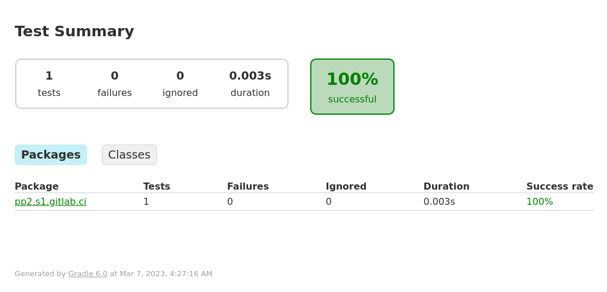

# Github CI

Esta guía tiene como objetivo explicar los pasos a seguir para configurar la herramienta de integración continua “Github Actions” integrada en la propia interfaz gráfica del repositorio.

Documentación de Gitlab: **[**https://docs.gitlab.com/ee/ci/quick_start/](https://docs.github.com/en/actions/quickstart)

# Paso a paso con Java y Gradle

Para la realización de la presente guía se utilizará como ejemplo un proyecto Java que utiliza el gestor de dependencias a Gradle.

Gitlab-ci cuenta con entornos virtuales llamados *runners* que se encargan de preparar el ambiente de ejecución para poder correr el *build* y los casos de *test* del proyecto.

### Setup

1. Crear un proyecto Gradle en *Eclipse for Java Developers* (Version: 2018-12 (4.10.0) o superior).
2. Crear un repositorio en Gitlab y ejecutar git push del proyecto Gradle al repositorio.

### Activar Github Actions

Dentro del repositorio: 

- Actions
- *Java with Gradle*
- *Commit changes*

Esto generará un archivo .yml en el directorio .github/workflows dentro del repositorio. 

## Configuración Multiproyecto

1. Entrar en [https://jitpack.io/](https://jitpack.io/)
2. Copiar la URL del proyecto que se desea agregar como dependencia (en este caso el proyecto A) -> Lookup -> Snapshot -> Get it -> Copiar y pegar el código generado para gradle.
3. En el build.gradle del proyecto B agregar la URL de jitpack.

```yaml
allprojects {
    repositories {
        ...
        maven { url 'https://jitpack.io' }
    }
}
```

1. En el archivo build.gradle del proyecto B agregar la dependencia hacia el proyecto A y realizar commit and push del build.gradle.

```
dependencies {
      implementation 'com.gitlab.autor:gitlab-ci-test:-SNAPSHOT' 
}
```

## Building and Testing

Para la presente guía utilizaremos el plugin “Junit” que se encargará de ejecutar los tests unitarios sobre nuestro código. Luego, estos reportes serán publicados por github actions.

Los distintos niveles de ejecución de github ci se representan con un *pipeline.* Cada fase de ejecución dentro del *pipeline* es llamado job **en el .yml.

1. Ir a la URL del proyecto en Github y seleccionar “Actions”.

Para llevar a cabo el proceso de building de gradle contaremos con la siguiente sintaxis para el archivo .github/workiflows/gradle.yml

```yaml
name: Java CI with Gradle

on:
  push:
    branches: [ "main" ]
  pull_request:
    branches: [ "main" ]

permissions:
  contents: read
  security-events: write

jobs:
  build:

    runs-on: ubuntu-latest

    steps:
    - uses: actions/checkout@v3
    - name: Set up JDK 11
      uses: actions/setup-java@v3
      with:
        java-version: '11'
        distribution: 'temurin'
        
    - name: Build with Gradle
      run: ./gradlew build
```

Dentro del proceso de build, en el primer paso se descarga un entorno de ejecución para una JVM con gradle y luego se ejecuta el comando para ejecutar el build de gradle. 

Una vez que contemos con nuestro proceso de building funcionando, se agregan las tareas correspondientes para agregar el reporte de la ejecución de los tests, publicarlas como un “artifact” y renderizar estos resultados cómo una página estatica en Github. 

```yaml
    - name: Archive Test Results
      uses: actions/upload-artifact@v2
      with:
        name: test-results
        path: build/reports/tests/test/
  
    - name: Download Test Results
      uses: actions/download-artifact@v2
      with:
        name: test-results
        path: test-results
    
    - name: Publish Test Results as Github Pages
      uses: peaceiris/actions-gh-pages@v3
      with:
        github_token: ${{ secrets.TOKEN }}
        publish_dir: ./test-results/
```

Finalmente, nuestro archivo gradle.yml quedaría de la siguiente manera: 

```yaml
name: Java CI with Gradle

on:
  push:
    branches: [ "main" ]
  pull_request:
    branches: [ "main" ]

permissions:
  contents: read
  security-events: write

jobs:
  build:

    runs-on: ubuntu-latest

    steps:
    - uses: actions/checkout@v3
    - name: Set up JDK 11
      uses: actions/setup-java@v3
      with:
        java-version: '11'
        distribution: 'temurin'
        
    - name: Build with Gradle
      run: ./gradlew build
        
    - name: Archive Test Results
      uses: actions/upload-artifact@v2
      with:
        name: test-results
        path: build/reports/tests/test/
  
    - name: Download Test Results
      uses: actions/download-artifact@v2
      with:
        name: test-results
        path: test-results
    
    - name: Publish Test Results as Github Pages
      uses: peaceiris/actions-gh-pages@v3
      with:
        github_token: ${{ secrets.TOKEN }}
        publish_dir: ./test-results/
```

Tener en cuenta que para que la última tarea de ejecución funcione debemos generar y configurar un TOKEN de seguridad para nuestro repositorio: 


Cómo resultado final, se puede observar el resultado de los tests con el siguiente formato: 



#
